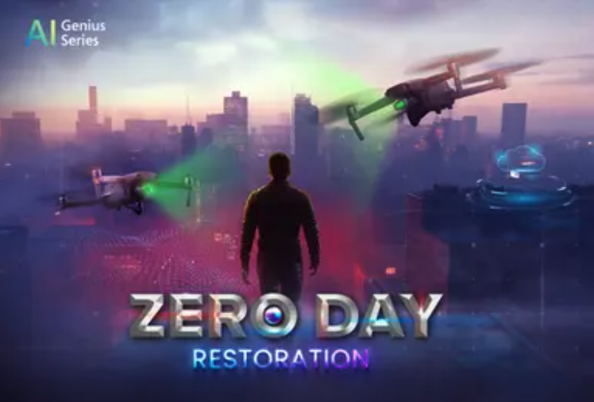

<p align="center">
  
</p>

# AI Genius Series / Azure RAG Challenge – Zero Day in Zero Hour

A production-ready RAG API that ingests incident documents, retrieves with Azure AI Search, and generates grounded answers using Azure OpenAI. Deployed on Azure App Service with a public `/ask` endpoint.

## Objectives / Challenges
- Build end-to-end RAG on Azure under time pressure.
- Explain root cause, IoCs, and mitigations from forensic docs.
- Deliver a live, judge-accessible endpoint.

## Overview
- Flask API with POST `/ask`:
  - Input: `{"question":"...", "strategy":"auto|semantic|vector"}`
  - Output: JSON `{summary[3], iocs[], mitigations[5], citations[]}`
- Diagnostic mode: prefix question with `[diag]` to see retrieved snippets.

## Architecture
<p align="center">
  
</p>

## Services
flowchart LR
    A[Azure Blob Storage] --> B[Azure AI Search<br/>(docs-index)]
    B --> C[Azure OpenAI<br/>(gpt-4o-mini, text-embedding-3-large)]
    C --> D[Azure App Service (Linux)]

## Quickstart (local)
```bash
python3 -m venv .venv && source .venv/bin/activate
pip install -r requirements.txt
cp .env.example .env   # fill in values
python app.py
# Ask:
curl -s -X POST http://127.0.0.1:8000/ask \
  -H "Content-Type: application/json" \
  -d '{"question":"[diag] Blue Raven root cause","strategy":"semantic"}' | jq .
